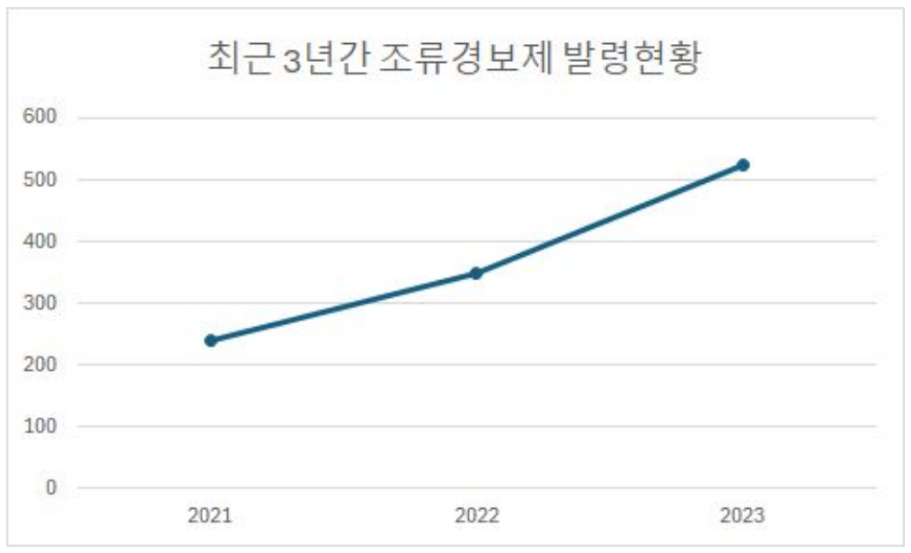
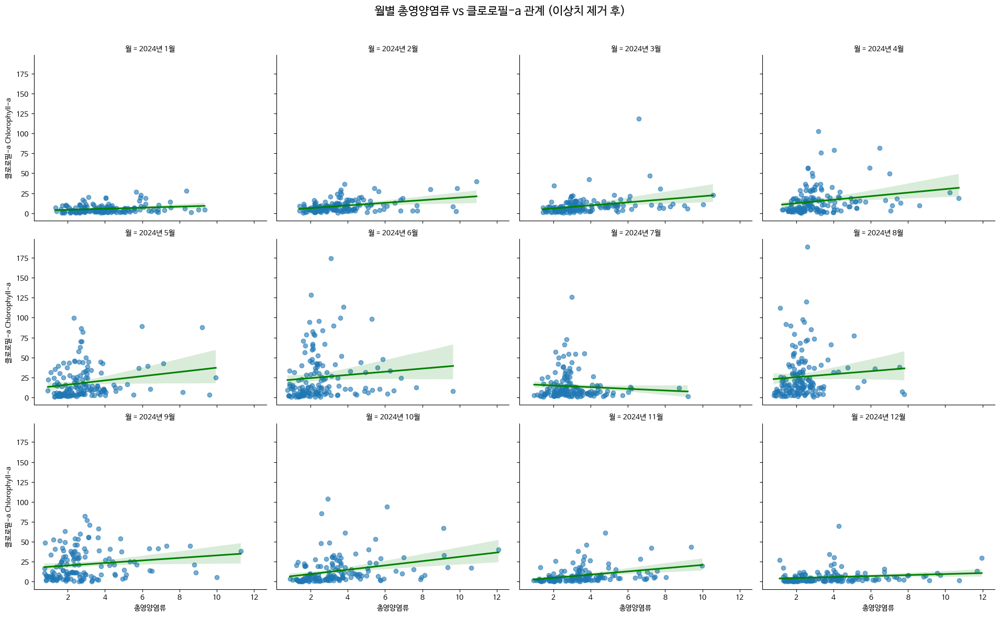
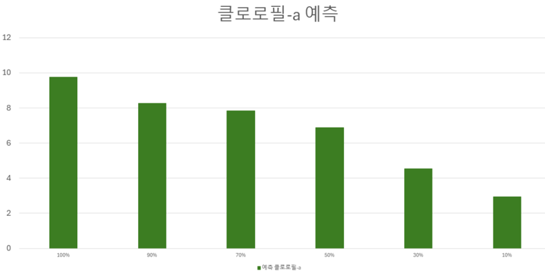
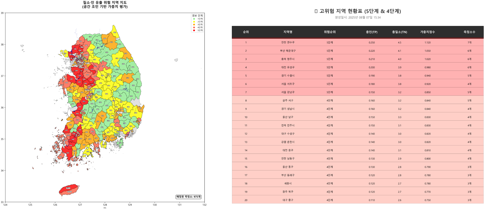
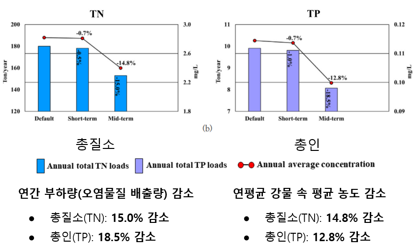

# 🎓 Project : 녹조 발생 원인 분석 및 고위험 지역 지도화

**본 프로젝트는 공공 환경 데이터를 활용하여 녹조 발생의 주요 원인을 분석하고, 총질소(TN)·총인(TP)의 영향력을 정량적으로 검증한 뒤, 녹조 고위험 지역을 지도화하여 완효성 비료 보조금 정책의 타겟팅 개선 가능성을 제안한 데이터 분석 프로젝트입니다.**

- **Team Name:** 투게더(2조)
- **Members:** 홍민석, 남세은, 임서현, 정서영, 홍성원
- **Period:** 2025.07.28 ~ 2025.08.08

---
## 📑 목차 (Table of Contents)

1. 프로젝트 개요
2. 내 역할
3. 데이터 소스
4. 시스템 아키텍처
5. 문제 정의 및 가설
6. 데이터 분석 및 결과
7. 정책 제안
8. 고위험 지역 지도화
9. 기대효과 및 결론 
10. 아쉬웠던 점 및 배운점 

---
## 1. 프로젝트 개요
**문제 제기**
  
  녹조는 남세균 등 식물플랑크톤의 대발생으로 발생하는 현상입니다. 
  (출처: 식물학백과, 한국식물학회)

  본 현상인 녹조는 국민 건강 위협, 막대한 재정 부담, 그리고 하천 및 호소 생태계 악화를 초래하는 중대한 사회 문제입니다. 낙동강 수질 개선을 위해 2025년까지 2조 708억 원이 투입될 예정이며, 정수 처리시설 유지비용이 매월 9억 원 이상 발생하는 등 경제적 손실이 매우 큽니다.

  녹조 발생의 주요 요인은 오염물질(특히 총질소와 총인), 수온 및 일사량, 그리고 물 순환 정체로 구분됩니다. 이 중 **수온과 일사량**은 자연 요인으로 조절이 어렵기 때문에, 본 프로젝트는 **인위적 관리가 가능한 영양염류(총질소, 총인) 저감**에 초점을 맞췄습니다. 
  
---

## 2. 내 역할
- **데이터 수집**
    - 녹조, 비점오염원, 비료, 영양염류 등 관련 국내외 논문 및 데이터셋 확보
    - 하천 수질 현황 자료 (2022 ~ 2025년)에서 총질소·총인·클로로필-a  데이터 추출
    
- **데이터 분석**
    - Python(Pandas, Seaborn) 기반 상관관계 분석
    - 결측치·이상치 처리 후, 금강권역 총질소·총인과 클로로필-a의 양의 상관관계 확인

- **데이터 워크플로우 시각화**
    - Figma로 데이터 수집 → 분석 → 정책 제안의 흐름 다이어그램 제작
        
- **발표 자료 제작 협업**
    - 최종 발표자가 초안을 제작한 뒤, 팀원 전원이 내용·시각적 요소를 검토 및 보완
    - 데이터 분석 결과와 시각화를 효과적으로 전달하기 위해 슬라이드 구조와 디자인 개선 참여
---

## 3. 데이터 소스 목록
### 3.1 참고문헌 
1. 환경부. (2016). 『녹조(녹색물질, 녹조현상은 무엇인가?)』
2. 환경부. (2024). 『수질오염에 따른 녹조 발생과 시민 건강』, 대구MBC.
3. 한국환경산업기술원(KETI). 『환경 보건 연구 동향』
4. Sang-Leem Yuna. (2024). Correlation and Prediction Analysis of Cyanobacteria with Water Environment Data.
5. 임○○ 외 (2019). HSPF를 이용한 농업 비점오염원 최적관리방안 예측. 『한국습지학회지』, 25(2).
6. Lingrana J.L. (2019). Nitrogen-phosphorus associated metabolic activities. *Science Reports*.
### 3.2 활용 데이터 
| 데이터셋 명 (Dataset) | 기간 (Period) | 출처 (Source) |
| --- | --- | --- |
| 환경부 4대강 하철 수질 측정 데이터 | 2012-2025 | 환경부 |
| 수질 측정망 위치 정보 | - | 환경부 |
| 행정구역 시군구 경계 데이터 | - | 국토교통부  |
| 조류경보제 대상 댐(22개) 중 K-water가 관리 중인 댐(13개) 발령 현황 | - | 환경부  |
| 재정사업 예산 데이터 | - | 열린재정   |
---

## 4. 시스템 아키텍처
 
---

## 5. 문제 정의 및 가설 
**문제 정의 :**
녹조 발생은 국민 건강과 사회경제적 부담을 심화시키는 중대한 환경 문제입니다. 환경부와 환경단체는 녹조 독소가 주민 건강을 위협하며, 수질 개선을 위한 막대한 예산 투입과 사회적 갈등 발생을 보고하고 있습니다. 현재 정책은 가축분뇨 관리를 중심으로 이루어지고 있으나, 녹조 발생의 주요 영양염류 오염원인 비료에 대한 관리 정책은 상대적으로 미흡한 것을 알 수 있습니다.

**정책 한계 :**
녹조 원인 중 질소와 인의 과반 이상이 비료에서 비롯되지만, 비점오염원 사전 예방 정책은 가축분뇨에 집중되어 있어 비료로 인한 녹조 발생 저감이 충분히 이루어지지 않고 있습니다.

**가설 설정 :**
총질소(TN) 및 총인(TP) 농도가 감소하면, 녹조 지표인 클로로필-a 농도 역시 통계적으로 유의미하게 감소할 것이다.

---
## 6. 데이터 분석 및 결과
### 0. 데이터 개요
환경부에서 제공하는 4대강 유역의 수질 데이터 (2012~2025년)를 활용했습니다. 그 중 저는 금강 권역의 2022년부터 2025년까지 데이터를 중심으로 상세 분석을 진행해 이 부분에 대해서 설명하겠습니다. 

### 1. 4대강 유역 데이터 분석  
- **데이터 전처리 :** 이상치 왜곡 방지를 위해 각 변수별 1% ~ 99% 분위수 밖의 값을 제거 / 결측치는 적절한 대체법을 통해 보완했습니다. 
- **분석 목표 :** 녹조의 3대 주요 요인 중 총질소(TN)와 총인(TP)의 영향력을 정량적으로 평가 및 상대적 중요도를 규명하는 데 초점을 맞췄습니다. 
- **분석 결과 :** XGBoost 변수 중요도 분석 결과, 녹조 발생(클로로필-a)에 대한 영향력은 **수온 > 총질소(TN) > 총인(TP) > 유속** 순으로 나타났습니다. 수온은 자연적 요인으로 정책적 제어가 어렵지만, 총질소와 총인은 인위적 관리가 가능한 요인으로, 유속보다 더 큰 설명력을 가지는 주요 변수로 확인되었습니다. 아래 그림은 금강권역 2024년 데이터를 월별로 분석한 결과로, 이상치 제거 후에도 대부분의 월에서 **영양염류(TN+TP)와 클로로필-a 간의 양의 관계가 유지됨**을 보여줍니다. 이는 총질소·총인의 저감이 녹조 감소로 이어질 가능성이 있음을 뒷받침할 수 있습니다. 

  
  > 대부분의 월에서 회귀선 기울기가 양(+)를 보이고 있습니다. 특히 여름철(5~9월)로 갈수록 데이터 분산과 회귀선 기울기가 함께 증가하는 경향이 나타나, 녹조 발생이 활발한 시기에 영양염류(총질소·총인)와 클로로필-a 간의 연관성이 더 뚜렷해짐을 확인할 수 있습니다.

  
  > 녹조 발생(클로로필-a)의 상대적 중요도를 비교한 결과 수온 > 총질소, 총인 > 유속 순으로 나타납니다. 
- **코드 설명 :** 자세한 데이터 전처리 코드는 [`src/6_processing/2024_Geumgang_WaterQuality_Analysis.py`](src/6_processing/2024_Geumgang_WaterQuality_Analysis)에서 확인할 수 있습니다.

### 2. 클로로필-a 예측 
앞서 저희 조가 세웠던 "총질소(TN) 및 총인(TP) 농도가 감소하면, 녹조 지표인 클로로필-a 농도 역시 통계적으로 유의미하게 감소할 것이다." 가설을 바탕으로 시나리오 검토를 위한 탐색적 분석으로 수행되었습니다. 
- **분석 방법 :** 4대강 유역 수질 데이터 → R² ↑ , RMSE ↓, XGBoost 모델 선정 → 예측 결과 도출 
- **분석 결과 :** 온도와 유속을 조절하지 않더라도, 질소와 인을 감소시키면 녹조 발생량도 줄어듭니다.
  
---
## 7. 고위험 지역 지도화
### 질소 인 유출 고위험도 지도 
  - **분석 방법 :** 데이터 수집(행정구역, 수질 등) → 데이터 전처리(좌표계 통일 등) → 데이터 분석 → 시각화
  - **분석 결과 :** 위험 지역 지도를 이용한 완효성 비료의 우선적 시범도입
    
    
  - **비고 :** 본 분석에서는 인과 요인 분석에 집중하였으며, 예측 모델링은 팀 내 다른 구성원이 수행하였습니다.
---

## 8. 정책 제안
**질소·인 유출 위험 지역을 중심으로 완효성 비료를 지원하여 총인·총질소 유출을 줄이는 비점오염 저감 정책**
- 완효성 비료는 석회질소, 깻묵, 두엄과 같이 토양 중에 있는 미생물작용에 의해 서서히 분해되어 양분이 녹아 나오면 이것이 작물에 의하여 이용되는 비료입니다.
- **정책 효과 :** 완효성 비료를 도입하면 양분이 서서히 분해되면서 질소와 인의 방출이 늦춰져 녹조 저감 효과를 기대할 수 있습니다. 
- **완효성 비료 지원 사업 시행 사례 :** 포항시는 5억1천만 원의 예산을 편성하고 2025년부터 도내 최초로 벼 재배 농가를 대상으로 완효성 비료 지원사업을 시행한다고 밝혔다. (...) 완효성 비료는 한 번의 시비로 벼 생육 시기별 양분을 효과적으로 공급할 수 있어 노동력과 비용을 동시에 절감할 수 있는 비료로 농가의 경영 안정에 실질적인 도움이 될 것으로 기대되고 있다. (출처 : 곽성일(2025.01.14), <포항시, 완효성 비료 지원 사업…오는 20일까지 희망 농가 접수>, 경북신문)
---

## 9. 기대효과 및 결론 
### 1. 완효성 비료로 대체했을 때, 총질소·총인의 연간 부하량과 연평균농도 저감 
  
  > 완효성 비료는 오염물질의 연간 부하량을 줄이는 동시에 강물 속 평균 농도도 함께 낮춰 수질 개선에 효과적입니다.
  (출처 : 이경석, 이동훈, 안영미 and 강주현. (2023). HSPF를 이용한 농업비점오염원 최적관리방안에 따른 수질개선효과 예측. 한국습지학회지)
### 2. 질소·인 유출 지역 지도의 활용 가능성 
녹조 발생 주요 원인인 **질소·인**을 고위험지도를 활용해 고위험 지역에 우선적으로 완효성 비료를 도입하는 것입니다. 시범 지역에 우선 적용 후, 성과를 확인해본 다음 성과에 따라 차순위 지역까지 단계적으로 확대 적용 가능합니다. 

--- 
## 10. 아쉬웠던 점 및 배운점 
학교에서 배운 데이터 분석 기초 이론을 바탕으로 처음으로 수행한 실습 프로젝트였습니다. 분석 주제를 선정하는 단계부터 어려움이 있었지만, 팀원들과 지속적으로 논의하며 방향을 구체화해 나갈 수 있었고, 협업을 통해 프로젝트를 성공적으로 마무리할 수 있었습니다. 다만 ‘재정데이터 분석’이라는 주제에 비해 실제 재정 데이터를 충분히 활용하지 못한 점은 아쉬움으로 남습니다. 향후 유사한 프로젝트를 진행하게 된다면 재정 데이터를 보다 적극적으로 분석에 반영하여, 도출된 결론과 정책적 제안을 더욱 정교하게 보완하고 싶습니다.
이번 프로젝트를 통해 데이터 분석이 단순한 기술 적용이 아니라, 문제 정의 → 가설 설정 → 데이터 분석 → 결과 해석 → 정책 제안으로 이어지는 하나의 사고 과정임을 체감할 수 있었습니다. 또한 분석 전 과정에 직접 참여하면서 데이터 분석에 대한 흥미와 관심이 더욱 커지는 계기가 되었습니다.
